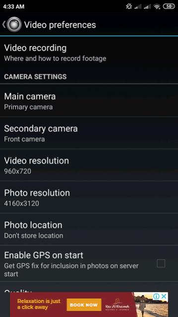
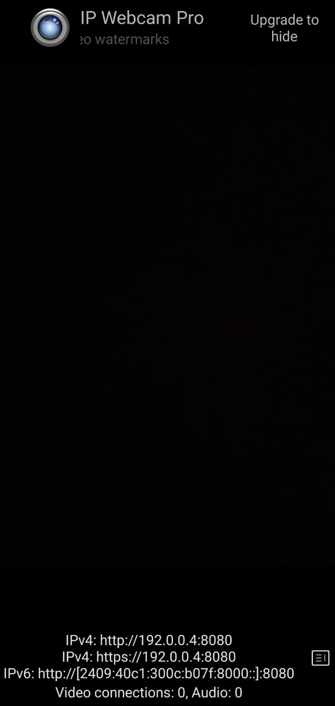
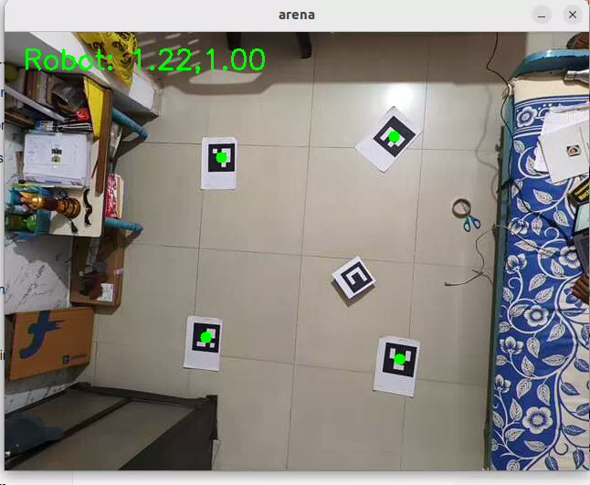
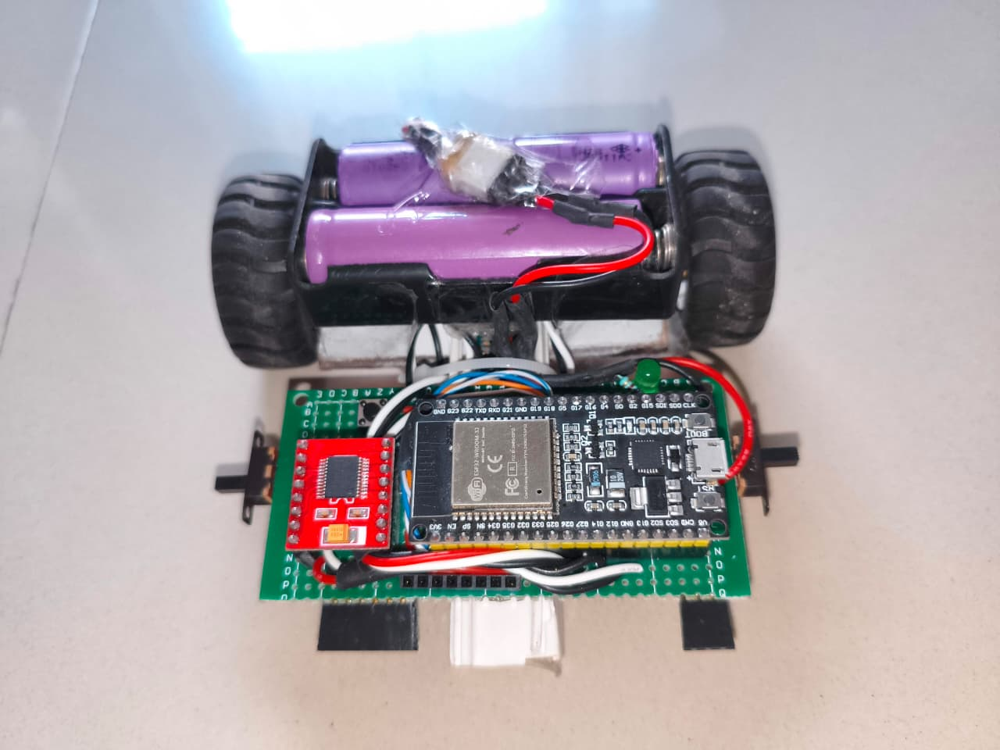

# Project Name

In this project i have built the any system using camera that allows our system to know the excet location of our robot in a define arena. Arena is a predefine area whos corners are marked using Aruco marker. We have same mark on the robot too, the continueous processing on the feed of the camera is done to know the location of the robot. System is built in the ROS2 enviornment and the robot contain ESP32 as the microcontroller board, so we sended orentation and linear movment coordinates to the robt over wifi. All the computation is done on the laptop as we have created a local network over wifi for the data transfer.

Example:
A ROS2-based indoor mapping and vision system using smartphone camera streaming and OpenCV.

---

## Features

- Real-time camera streaming
- ROS2 publisher/subscriber communication
- OpenCV image processing
- Indoor mapping support
- Easy to extend
- Works on Ubuntu + ROS2 Humble

---

## Technologies Used

- ROS2 Humble
- Python / C++
- OpenCV
- Ubuntu 22.04
- colcon build system

---

## Project Structure

```bash
project_name/
│── src/
│   ├── package_1/
│   ├── package_2/
│
│── launch/
│── scripts/
│── README.md
```

---
## 📸 Installation of the IP Webcam app

Install the app from the playstore in the mobile phone
<p align="center">
  
</p>


---
## You can set the video resolution and size in the app as shown below

<p align="center">
  
</p>

---
## After starting the server from the 3 dots in the top-right corner. You will see the IP address. use this IP address in the below written command Camera Stream

<p align="center">
  
</p>


---


## Installation

### 1. Clone Repository

```bash
git clone https://github.com/krishna-177/indoor_navigation_system.git
cd indoor_navigation_system
```

### 2. Build Workspace

```bash
colcon build
```

### 3. Source Workspace

```bash
source install/setup.bash
```

---

## Running the Project

### ESP32 code
Code for the ESP32 is in side the aruco_detector folder. Just copy paste this code. Change the wifi credentials in the code according to yours.


### Run for the getting the Camera stream.
Make sure that you have both laptop and mobile phone connected on the same network
// use the IP which will be displayed on the mobile screen when it start the server for streaming.

```bash
ros2 run my_camera ip_stream_node --ip 192.168.1.8:8080 
```


### Run Aruco detector Node
Run this command first and then start the robot having the ESP32. Also once again make sure the ESP32 connect to the same network that of laptop and mobile connected to.

```bash
ros2 run micro_ros_agent micro_ros_agent udp4 --port 8888
```


### Run Aruco detector Node

```bash
ros2 run aruco_detector aruco_robot_pose
```

### Run Clickable Window Node

```bash
ros2 run aruco_detector goal_click_node
```


### Run Controlling Node

```bash
ros2 run aruco_detector controller_node
```


---

## Working Setup

The image below shows the actual my working setup. how I placed the aruco codes and camera.

<p align="center">
  
</p>


---

## Bot used

This is the the bot baded on the ESP32 wroom module having capablity to connect with wifi. I will put Aruco marker on the top of this bot so that i can locate its position and orientation. 
This Bot consist of...
1) ESP32 Wroom
2) TB66 Motor driver
3) 2- N20 motor
4) 2S lithium ion batt

<p align="center">
  
</p>


---

## Final Working video of the project

<a href="images/video.webm">
  
</a>


## 🧠 How It Works

Explain the working flow briefly.

Example:

1. Smartphone camera streams video over WiFi.
2. OpenCV captures frames.
3. ROS2 node publishes frames.
4. Another node processes the data for mapping.

---

## 🔮 Future Improvements

- Add SLAM integration
- Improve object detection
- Add autonomous navigation
- Optimize performance

---

## 🤝 Contributing

Pull requests are welcome.

---


## 👨‍💻 Author

Patel Krishna Sanjaykumar
Electronics & Communication Engineering  
Dharmsinh Desai University
